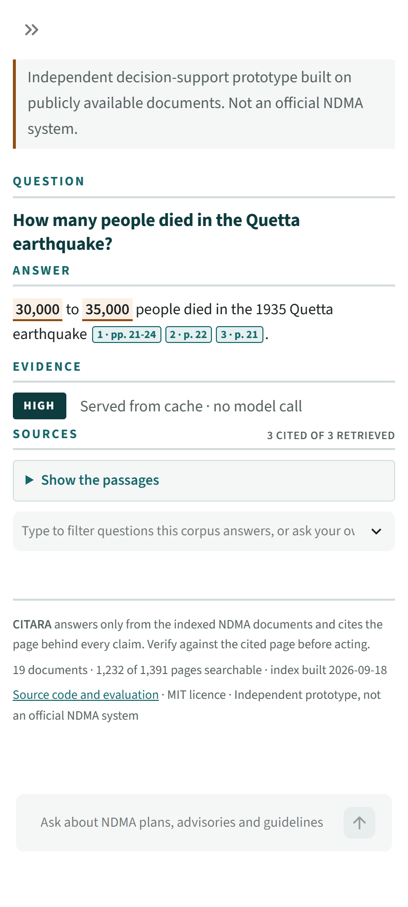
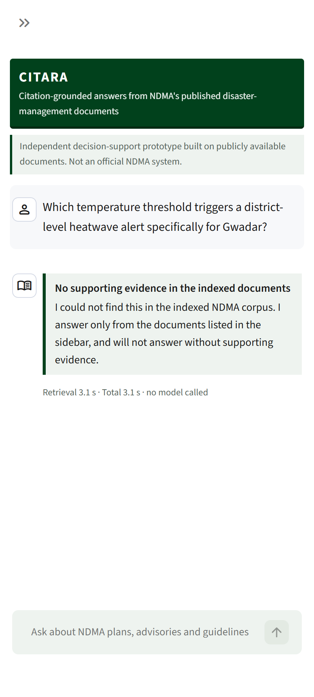
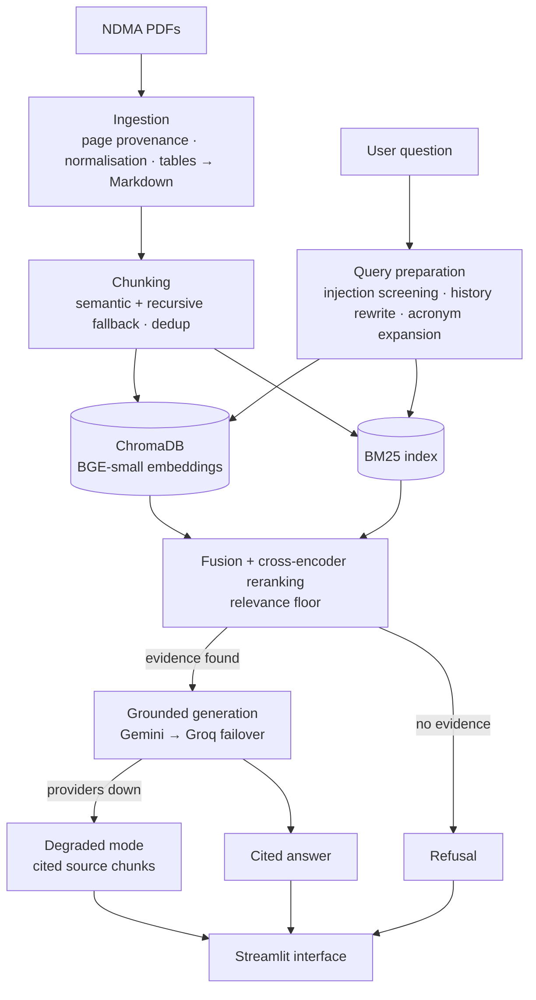
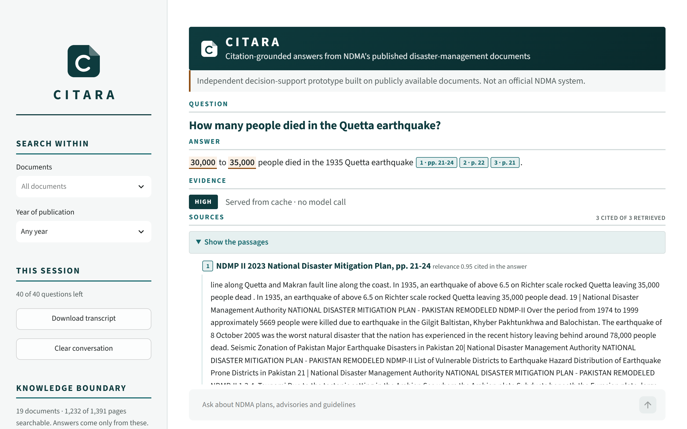

# CITARA

**Citation-grounded AI assistant over Pakistan's national disaster-management doctrine.**


CITARA is a retrieval-augmented generation (RAG) system that ingests NDMA's published policy corpus — the National
Disaster Response Plan, the 2022 Floods Post-Disaster Needs Assessment, the National DRR Strategy 2025–2030, and
monsoon, heatwave and GLOF advisories — and answers operational questions in natural language.

Every answer carries **page-level citations** (e.g. *NDRP, p. 47*) so it can be verified before acting, and the system
**refuses to answer** when the corpus holds no supporting evidence. In disaster response, a confident wrong answer is
more dangerous than no answer.

> **Disclaimer:** CITARA is an independent decision-support prototype built on publicly available documents.
> It is not an official NDMA system.

<p align="center">
  
  &nbsp;&nbsp;
  
</p>

*Left: two documents disagree on the 1935 Quetta death toll, and the answer cites each figure to
its page instead of silently picking one. Right: a plausible operational question the corpus
cannot answer is refused before any model is called.*

---

## The problem

The doctrine already exists — written, approved and published. The bottleneck is retrieval: a district officer during a
flood alert cannot keyword-search a 300-page response plan across several PDFs to find an evacuation trigger threshold.
CITARA turns a static PDF archive into a queryable decision-support layer, cutting retrieval from minutes to seconds.

## Design highlights

| Capability | Approach |
|---|---|
| Grounded answers | Strict grounding prompt, mandatory inline citations mapped to document + page |
| Refusal by design | Relevance floor calibrated on the gold set — if no evidence clears it, generation never runs and no model is called |
| Retrieval quality | Dense (BGE) + BM25 behind reciprocal rank fusion, with an ablation deciding the weights — measured, not assumed |
| Follow-up questions | History-aware query rewriting over the last few turns |
| Tables | PDF tables extracted and serialised to Markdown (critical for PDNA damage figures) |
| Chunking | Semantic breakpoint chunking with deterministic recursive fallback and near-duplicate removal |
| Security | Prompt-injection screening on user input **and** on retrieved document text |
| Resilience | Retry with backoff, LLM provider failover, response caching, degraded mode returning cited sources, a daily budget counted per request |
| Data sovereignty | Embeddings and reranking run locally on CPU — document content never leaves the host for indexing |
| Evaluation | 30-question gold set, Hit Rate@k, MRR, p50/p95 latency, and a five-configuration ablation that changed the defaults |

## Architecture



## Tech stack

| Layer | Choice |
|---|---|
| PDF parsing & tables | PyMuPDF |
| Orchestration | LangChain (LCEL) |
| Embeddings | `BAAI/bge-small-en-v1.5` (local, CPU) |
| Vector store | ChromaDB (persistent) |
| Sparse retrieval | BM25 |
| Reranking | `BAAI/bge-reranker-base` cross-encoder |
| LLMs | Google Gemini (primary), Groq (failover) — free tier, model IDs configurable |
| Interface | Streamlit |
| Configuration | Pydantic Settings |
| Tooling | uv, Ruff, mypy, pytest |

## Roadmap

- [x] Project scaffolding, pinned environment, CPU-only deployment profile
- [x] Corpus audit and provenance record — 19 documents, 1,391 pages ([`docs/SOURCES.md`](docs/SOURCES.md))
- [x] Ingestion pipeline — 1,633 records from 1,232 pages, 512 Markdown tables, page-level provenance
- [x] Chunking — 3,141 chunks, semantic splitting with page-range citations, 188 duplicates removed
- [x] Dense + sparse indexing — ChromaDB (cosine, tuned HNSW) + BM25 built in one pass, incremental rebuilds
- [x] Retrieval — dense + BM25, RRF fusion, cross-encoder gate, floor calibrated on the gold set ([`eval/RESULTS.md`](eval/RESULTS.md))
- [x] Grounded generation — cited answers, refusal before any model call, Gemini to Groq failover, degraded mode
- [x] Guardrails — injection defense on input and on retrieved text, scope control, non-identifying query log
- [x] Resilience — retry with backoff, disk cache, per-request daily budget, session cap, degraded mode, startup warm-up
- [x] Streamlit interface — page-level citation chips, source panel, evidence band, corpus boundary, refusal and error states, cold-start loading state, transcript export; tested at phone width
- [x] Ablation study — five configurations from one command ([`eval/ABLATION.md`](eval/ABLATION.md))
- [ ] Faithfulness and answer-relevance scoring, latency benchmarks
- [ ] Public deployment — index published as a release asset and fetched on first start

## Getting started

Requires [uv](https://docs.astral.sh/uv/). Python 3.12 is pinned via `.python-version`.

```bash
git clone https://github.com/meeasadamin/CITARA.git
cd CITARA
uv sync                 # creates .venv with pinned dependencies (CPU-only PyTorch)
cp .env.example .env    # add GOOGLE_API_KEY and GROQ_API_KEY
```

Then run the interface:

```bash
uv run streamlit run streamlit_app.py
```

With no local index, the app downloads the published one (26 MB) on first start and checks it
against a pinned checksum, so a clone runs without the source PDFs. To build your own instead,
put the PDFs in `docs/` and run:

```bash
uv run python -m citara.ingestion && uv run python -m citara.chunking && uv run python -m citara.indexing
```

Without an API key the app still answers with cited source passages, and says that no summary
is available.



Source PDFs go in `docs/` (not redistributed in this repository); their source URLs and download dates are recorded
in [`docs/SOURCES.md`](docs/SOURCES.md).

## Project layout

```
src/citara/
  ingestion/    PDF extraction, provenance, tables, corpus manifest
  chunking/     semantic chunking, fallback splitting, deduplication
  indexing/     embeddings, ChromaDB, BM25
  retrieval/    query preparation, hybrid fusion, reranking, relevance floor
  guardrails/   prompt-injection defense, scope control
  generation/   grounded generation, citations, provider failover
  resilience/   quota budgeting, caching, backoff, degraded mode
  ui/           Streamlit interface: layout in app.py, rendering rules in presenters.py
streamlit_app.py  entry point for Streamlit (and Streamlit Community Cloud)
eval/           gold questions, metrics, ablation runs
tests/
scripts/        maintenance scripts
```

## Deployment

Runs on Streamlit Community Cloud: main file `streamlit_app.py`, **Python 3.12** (the pinned
PyTorch wheel is 3.12-only), and `GOOGLE_API_KEY` / `GROQ_API_KEY` in the app's Secrets.

The repository ships no index and no PDFs, so the built index is published as a release asset
and fetched on first start, verified against the checksum pinned in `citara/config.py`. After
rebuilding the index:

```bash
uv run python scripts/package_index.py     # writes dist/citara-index.tar.gz, prints its sha256
```

Upload that archive to the release, update `index_sha256`, and reboot the app. A mismatched or
truncated archive is refused rather than searched.

`requirements.txt` is exported from `uv.lock` with CPU-only PyTorch pinned by wheel URL;
regenerate it after any dependency change:

```powershell
powershell -ExecutionPolicy Bypass -File scripts/export_requirements.ps1
```

## License

[MIT](LICENSE)
